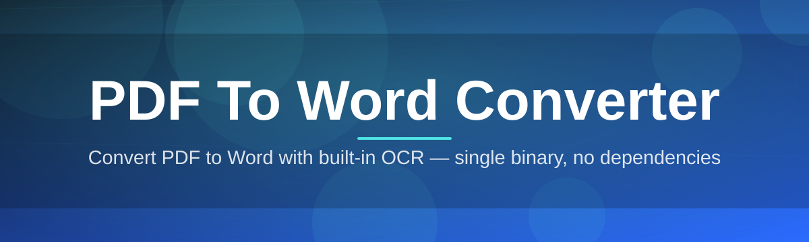
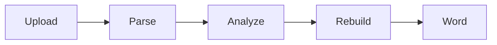

# pdf-to-word-converter-tool 📄🔄

  

*Turn static PDFs into fully editable Word documents, without losing the layout you worked hard to get right.*

  

---

## 🧭 Overview

Documents rarely stay in one format for their entire lifecycle. A contract drafted in Word becomes a PDF for signing, a report exported as PDF needs one more round of edits, or an archived scan needs to be reflowed into something a colleague can actually work with. The friction sits in the middle of that lifecycle — the moment someone needs to go *backwards*, from a locked-down PDF into an editable `.docx`, without the tables collapsing, the fonts shifting, or the headers vanishing.

**pdf-to-word-converter-tool** exists to remove that friction entirely. It is a focused, Windows-native application built around a single job: reconstruct PDF content — text, tables, images, and layout — into a clean, editable Word document. Rather than being a bloated do-everything suite, it treats PDF-to-Word conversion as an engineering problem worth solving properly, with attention to formatting fidelity, font mapping, and structural accuracy.

It's built for the people who touch documents daily and can't afford to re-type a 40-page report because a converter mangled the tables: legal teams handling contracts, students converting lecture PDFs into editable notes, HR departments reformatting scanned policies, and freelancers who just need a reliable PDF to Word converter that doesn't ask for a subscription to open a file. If document conversion is a recurring task in your workflow, this tool is designed to become invisible infrastructure — something that simply works, every time.

---

## 🔩 What Sets The Conversion Engine Apart

- **Layout-faithful reconstruction** — Paragraph spacing, column structure, and page breaks are preserved instead of being flattened into a single text blob.

- **Table intelligence** — Tables are detected as actual grid structures and rebuilt as native Word tables, not stitched-together tab characters.

- **Font and style mapping** — Bold, italic, headings, and font families are matched against Word's style system so the output doesn't look like a different document entirely.

- **Image and diagram retention** — Embedded images, charts, and scanned figures are extracted and repositioned rather than discarded during conversion.

- **Batch-friendly workflow** — Queue multiple PDFs and let the tool work through them sequentially without babysitting each file.

- **Offline-first processing** — Conversion happens locally on your machine; files are not routed through a remote server to be processed.

- **Encrypted PDF handling** — Password-protected files can be unlocked with the correct credentials before conversion begins.

- **Lightweight footprint** — A standalone executable with no bundled runtime bloat and no background services competing for resources.

> [!TIP]
> For scanned PDFs (image-only pages), enable the OCR pass in Settings before converting — otherwise the tool will treat the page as a single embedded image rather than extractable text.

---

## 🚀 Getting Started

1. **Visit the landing page** using the download button on this page.

2. **Download the installer** for your Windows version — no separate runtime is required.

3. **Launch the application** and drag in a PDF, or use the file picker.

4. **Click Convert**, choose a destination folder, and open the resulting `.docx` directly from the completion screen.

> [!NOTE]
> First-time launches may take a few seconds longer as Windows verifies the executable. This is normal and only happens once.

---

## 🖥️ System Requirements

| Component | Requirement |
|---|---|
| Operating System | Windows 10 (64-bit) or Windows 11 |
| Disk Space | 200 MB free (installer + working cache) |
| Memory | 4 GB RAM minimum, 8 GB recommended for large PDFs |
| Dependencies | None — fully standalone, no external runtime needed |
| Internet | Not required after download |

  

---

## ⚙️ How It Works

The conversion pipeline is intentionally linear — each stage hands off a cleaner version of the document to the next, so errors don't compound silently.

1. **Ingestion** — The PDF is parsed at the object level, separating text streams, image data, and vector layout instructions.

2. **Structural analysis** — Paragraphs, tables, and headings are inferred from spacing, font weight, and positional patterns.

3. **Style mapping** — Detected structures are matched to equivalent Word styles and formatting rules.

4. **Reconstruction** — A new `.docx` file is assembled using the mapped structure, preserving reading order.

5. **Verification pass** — The output is checked for missing text runs or broken table references before being finalized.

> [!IMPORTANT]
> Complex PDFs with heavy nested tables or rotated text blocks may require the verification pass to run twice internally — this is expected behavior, not a stall.

---

## 🧩 Troubleshooting

<strong>My converted Word document has misaligned tables.</strong>

This usually happens with PDFs generated from design software where tables are drawn as lines rather than structured cells. Try enabling "Aggressive Table Detection" in Settings for better results on these files.

<strong>The tool says a PDF is password-protected.</strong>

Enter the document's open password when prompted. If you don't have it, the file cannot be converted — this is a deliberate security boundary, not a limitation of the tool.

<strong>Scanned pages converted as blank text.</strong>

Scanned PDFs are images, not text. Enable OCR mode before conversion so text can be recognized and extracted properly.

<strong>Fonts look different in the output.</strong>

If the original font isn't installed on your system, the closest available match is substituted automatically. Installing the source font resolves this.

<strong>Conversion is slow on large PDFs.</strong>

Files with hundreds of pages or heavy embedded imagery take longer during the analysis stage. This is proportional to complexity, not a stuck process.

---

## 🎛️ Interface, Shortcuts & Personalization

The interface favors clarity over clutter — a single working pane, a queue list, and a status bar.

- `Ctrl + O` — Open a PDF file

- `Ctrl + Enter` — Start conversion

- `Ctrl + S` — Save output to a chosen folder

- `Ctrl + ,` — Open Settings

- **Themes** — Light, Dark, and a high-contrast mode for accessibility.

- **Settings panel** — Toggle OCR, table sensitivity, image extraction, and default output location.

> [!WARNING]
> Switching themes mid-conversion will not interrupt the process, but the progress bar visual may briefly flicker — this is cosmetic only.

---

## 🤝 Contributing & Community

This project grows through the people who use it daily and notice where it can be sharper. Bug reports, formatting edge cases, and feature suggestions are all welcome via Issues. Pull requests should include a clear description of the scenario being addressed — particularly for layout-related fixes, since PDF structures vary wildly in the wild.

> Discussions around tricky PDF layouts (multi-column academic papers, scanned legal forms, rotated tables) are especially valuable — they help harden the reconstruction engine for everyone.

---

## 📜 License

Released under the [MIT License](LICENSE), 2026. Use it, modify it, build on it — attribution appreciated but not enforced beyond the license terms.

---

## ⚠️ Disclaimer

This tool is provided "as is," without warranty of any kind. Formatting fidelity depends heavily on the structure of the source PDF; extremely complex or corrupted files may not convert perfectly. Always keep a backup of your original PDF before performing bulk conversions.

